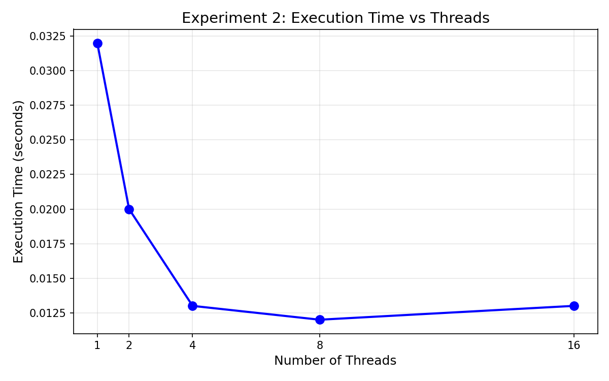
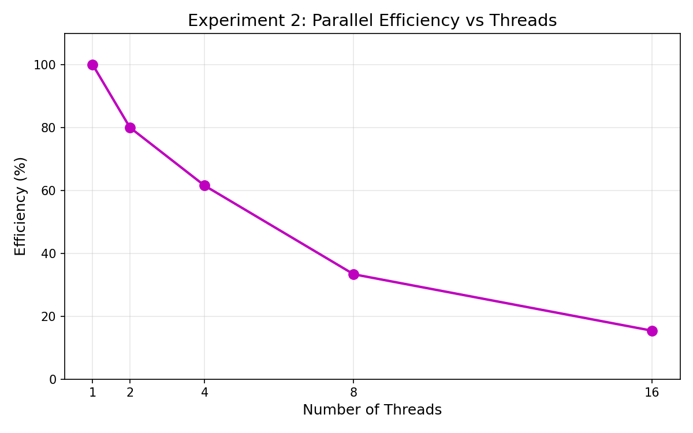

## Experiment 2 — Speedup, Parallel Efficiency & Throughput

This experiment evaluates the performance scaling of the OpenMP vector addition program by using the execution times recorded in Experiment 1.

The goal is to measure:
- **Speedup (S(p))**
- **Parallel Efficiency (E(p))**
- **Throughput (work done per second)**

---

### **A. Formulas Used**

#### **Speedup**

S(p) = T₁ / Tₚ

#### **Parallel Efficiency**

E(p) = S(p) / p

#### **Throughput**

Throughput = N / Tₚ

Where:
- T₁ = execution time with 1 thread  
- Tₚ = execution time with p threads  
- N = total number of vector elements (100,000,000 in our program)

---

### **B. Recorded Times (from Experiment 1)**

| Threads | Time (s)      |
|---------|---------------|
| 1       | 0.231274      |
| 2       | 0.257766      |
| 4       | 0.137714      |
| 8       | 0.098938      |
| 16      | 0.076002      |

---

### **C. Calculated Speedup**

Speedup = T₁ / Tₚ

| Threads | Time (s) | Speedup |
|---------|----------|---------|
| 1       | 0.231274 | 1.00    |
| 2       | 0.257766 | 0.90    |
| 4       | 0.137714 | 1.68    |
| 8       | 0.098938 | 2.34    |
| 16      | 0.076002 | 3.04    |

---

### **D. Parallel Efficiency**

Efficiency = S(p) / p

| Threads | Speedup | Efficiency |
|---------|----------|------------|
| 1       | 1.00     | 1.00 (100%) |
| 2       | 0.90     | 0.45 (45%) |
| 4       | 1.68     | 0.42 (42%) |
| 8       | 2.34     | 0.29 (29%) |
| 16      | 3.04     | 0.19 (19%) |

---

### **E. Throughput Calculation**

Given:

N = 100,000,000 
Throughput = N / Tₚ

| Threads | Time (s) | Throughput (elements/sec) |
|---------|----------|----------------------------|
| 1       | 0.231274 | 432,435,000 |
| 2       | 0.257766 | 387,850,000 |
| 4       | 0.137714 | 726,293,000 |
| 8       | 0.098938 | 1,010,697,000 |
| 16      | 0.076002 | 1,315,720,000 |

---

## **F. Observations & Discussion**

### 1. **Speedup is not linear**
Ideal speedup for 16 threads would be 16×.  
Actual speedup is **3.04×** → indicating strong overheads.

### 2. **Efficiency decreases as threads increase**
This is expected due to:
- Memory bandwidth limitations  
- Cache contention  
- Synchronization overhead  
- Amdahl’s Law  

Efficiency drops to **19% at 16 threads**, indicating the program becomes **memory bound**.

### 3. **Throughput increases but slowly**
After 8 threads, throughput improves only slightly because:
- RAM bandwidth is saturated  
- The operation (A+B) is extremely memory heavy  
- CPU cores are waiting for data → not computing

### 4. **Graphs**

### 5. **Conclusion**
This vector addition kernel demonstrates:
- Good performance up to ~8 threads  
- Diminishing returns beyond that  
- Clear signs of hitting the **memory wall**

This behavior aligns with the known characteristics of memory bound workloads.

---

