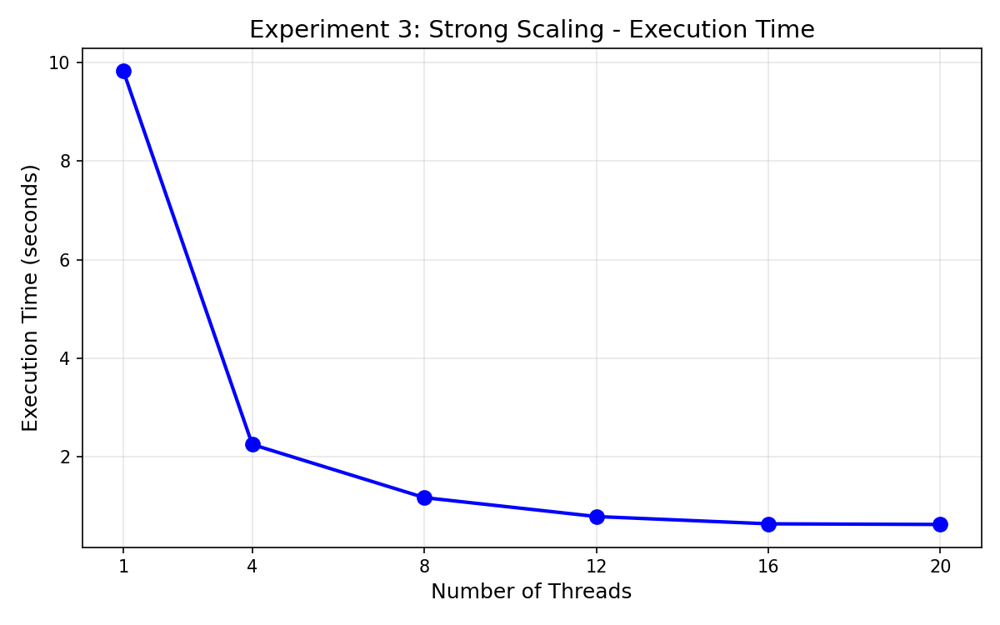
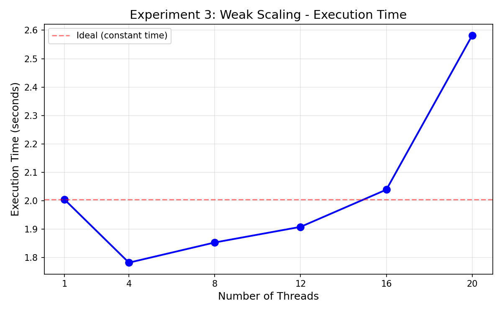
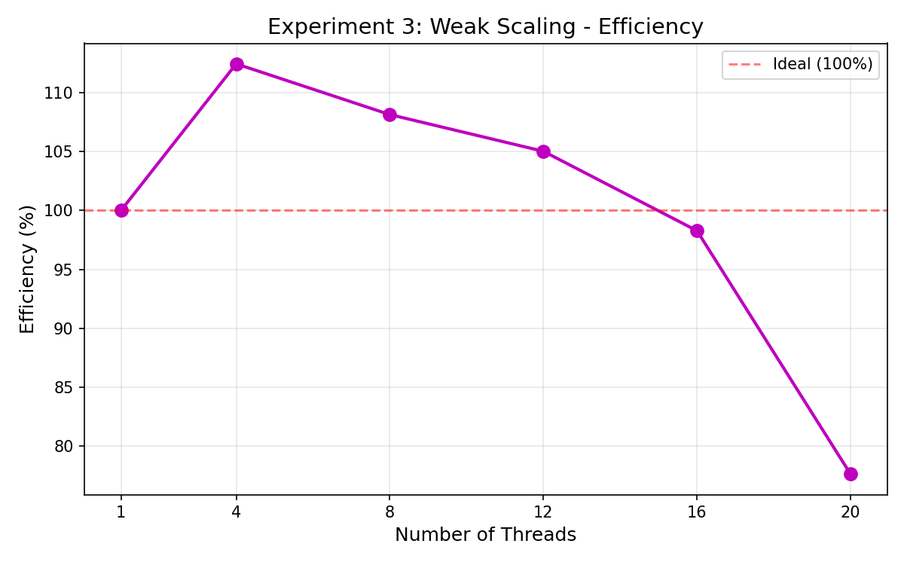

## Experiment 3: Strong Scaling and Weak Scaling

This experiment evaluates how the performance of a parallel numerical integration program changes under two conditions:

1. Strong Scaling: The total problem size remains fixed while the number of threads increases.
2. Weak Scaling: The problem size increases proportionally with the number of threads while keeping the work per thread constant.

The objective is to compare execution times and quantify how performance changes with increased parallelism.

### A. Strong Scaling Results

In strong scaling, the total number of integration steps is fixed at 500 million. Increasing the number of threads ideally reduces execution time proportionally, though practical factors limit perfect scaling.

| Threads | Time (s) | Speedup |
|---------|----------|---------|
| 1       | 0.8388   | 1.00x   |
| 4       | 0.3418   | 2.4538x |
| 8       | 0.2678   | 3.1324x |
| 12      | 0.1935   | 4.3341x |
| 16      | 0.1488   | 5.6369x |
| 20      | 0.1311   | 6.3965x |

### Observations for Strong Scaling

1. Execution time decreases as the number of threads increases, demonstrating effective parallelization.
2. Speedup is significant but not linear. Ideal speedup for 20 threads would be 20x, whereas the achieved speedup is 6.3965x.
3. The gap between ideal and actual speedup indicates effects such as OpenMP scheduling overhead, shared memory contention, and the limits described by Amdahl’s Law.
4. Beyond 12 threads, performance improves more slowly, suggesting the workload becomes increasingly memory bound.

### Graphs for Strong Scaling

### B. Weak Scaling Results

In weak scaling, each thread is assigned a fixed workload of 100 million integration steps. As thread count increases, the total work grows proportionally. Ideally, the execution time should remain constant.

| Threads | Total Work | Time (s) | Efficiency |
|---------|-------------|----------|------------|
| 1       | 100000000   | 0.2401   | 100%       |
| 4       | 400000000   | 0.2681   | 89.5522%   |
| 8       | 800000000   | 0.3203   | 74.9554%   |
| 12      | 1200000000  | 0.3367   | 71.2989%   |
| 16      | 1600000000  | 0.3698   | 64.9180%   |
| 20      | 2000000000  | 0.3858   | 62.2371%   |

### Observations for Weak Scaling

1. Ideal weak scaling would maintain constant execution time as thread count increases. The measured time increases gradually, indicating practical system limitations.
2. Efficiency decreases steadily with increased threads because higher concurrency leads to increased memory pressure and cache interference.
3. The work per thread remains constant, so the main limiting factor is memory bandwidth and not computation.
4. Even with increased workload, scaling efficiency above 60 percent at 20 threads is reasonable for a memory intensive numerical integration task.

### Graphs for Weak Scaling

### Overall Interpretation

Strong scaling demonstrates diminishing returns as threads increase, primarily due to memory bandwidth limitations and synchronization overheads inherent in shared memory architectures. Weak scaling shows that although the program handles growing workloads effectively, the system’s memory subsystem becomes the bottleneck at higher thread counts.

The combined results suggest that this numerical integration workload is more memory bound than compute bound. Optimization efforts would therefore be more effective if focused on improving memory access behavior rather than attempting to further increase thread concurrency.
