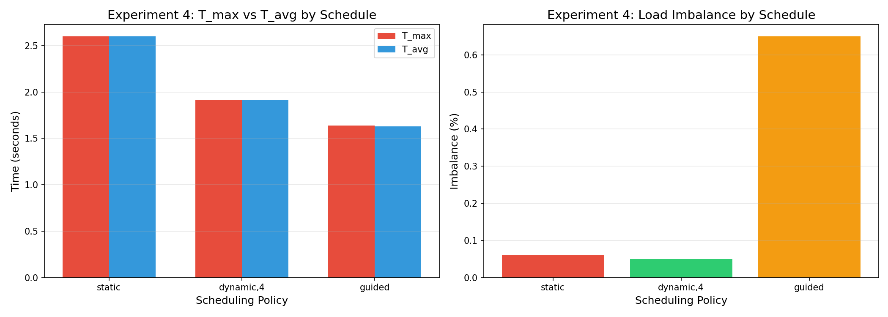

## Experiment 4 — Scheduling & Load Imbalance

The loop has non-uniform iteration costs (later iterations do more work), so different scheduling policies handle it differently. Ran with 16 threads.

Three policies tested:
- `static` — equal contiguous chunks, assigned before execution
- `dynamic,4` — small chunks handed out at runtime as threads finish
- `guided` — starts with big chunks, shrinks over time

Metrics:
- **T_max** = slowest thread's time
- **T_avg** = average across threads
- **Imbalance** = (T_max − T_avg) / T_avg

---

### Results

| Schedule   | T_max (s) | T_avg (s) | Imbalance (%) |
|------------|-----------|-----------|---------------|
| static     | 2.600     | 2.598     | 0.06%         |
| dynamic,4  | 1.910     | 1.910     | 0.05%         |
| guided     | 1.640     | 1.630     | 0.65%         |

- **Static** is the slowest overall (2.6s) — it can't redistribute work when iterations are uneven.
- **Dynamic** has the lowest imbalance (0.05%) and decent time (1.91s), since threads grab new chunks the moment they're free.
- **Guided** is actually the fastest wall-clock wise (1.64s) but has slightly higher imbalance (0.65%), probably because the tail end chunks don't divide evenly.

---

### Takeaway

For uneven workloads, dynamic or guided scheduling beats static. Dynamic gives the most even distribution, while guided can be faster overall by reducing scheduling overhead with larger initial chunks.

