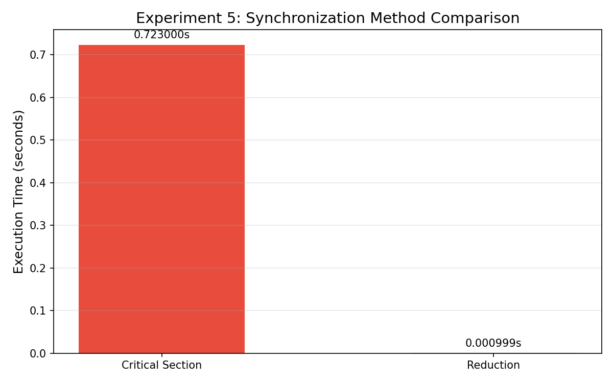
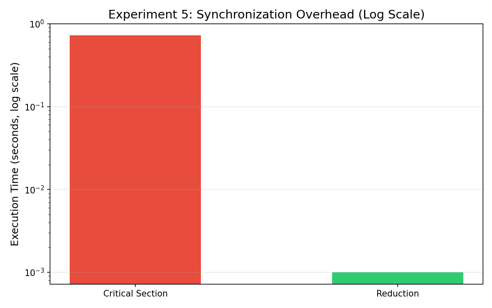

## Experiment 5 — Synchronization Overhead

Compares two ways to do a shared summation across threads:

1. **Critical section** — only one thread can update the sum at a time (lock-based)
2. **Reduction** — each thread keeps a private sum, merged at the end

---

### Results

| Method           | Time (s)  |
|------------------|-----------|
| Critical Section | 0.723000  |
| Reduction        | 0.000999  |

Critical is **723x slower** than reduction.

That's because with critical, every thread has to wait in line to touch the shared variable. With 16 threads that's a LOT of lock contention. Reduction avoids this entirely — threads never talk to each other during the loop, they just combine results at the very end.

---

### Bottom line

Never use `#pragma omp critical` for something that can be expressed as a reduction. The performance difference is massive — three orders of magnitude on this test.

