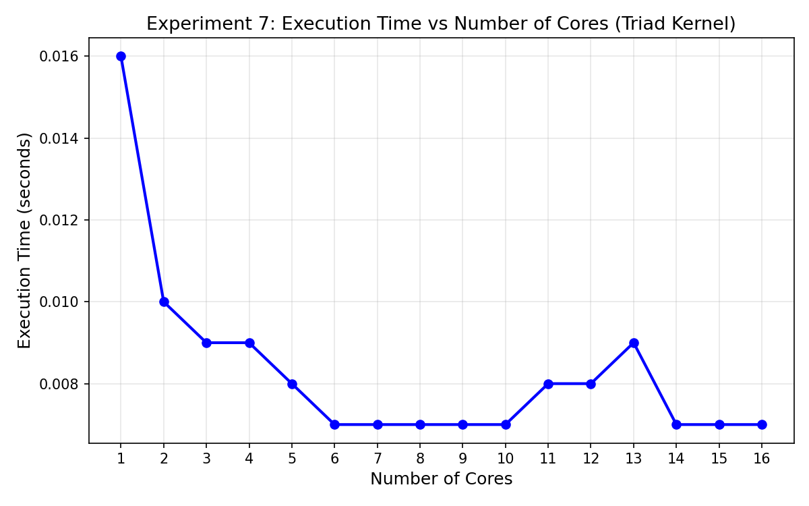
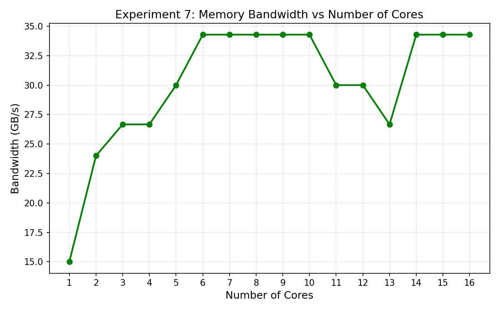
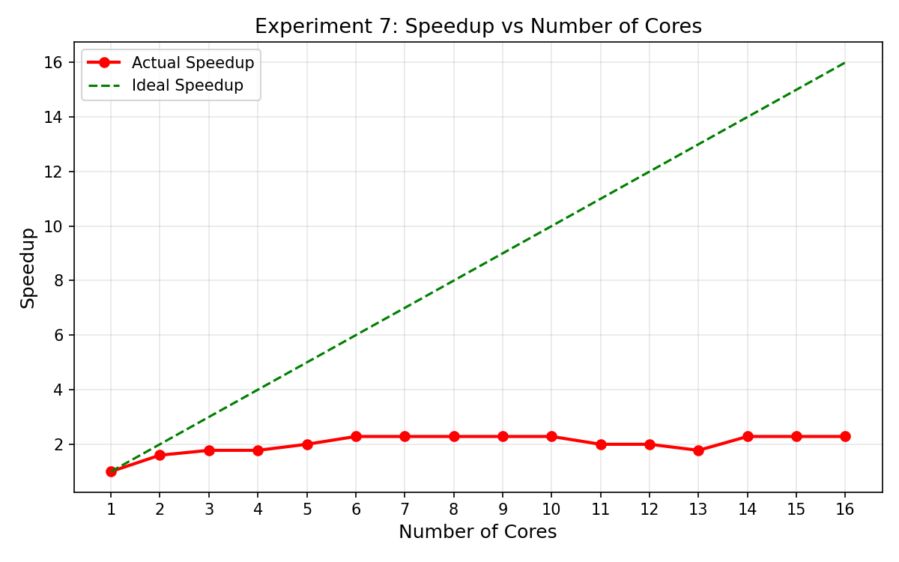

## Experiment 7: Memory Bandwidth Saturation

This experiment measures the memory bandwidth limitations of a multicore processor using the Triad kernel operation:

A[i] = B[i] + scalar × C[i]

This is a classical memory bound benchmark because the computation per data element is minimal compared to the volume of data being moved between memory and the CPU. The objective is to study how memory bandwidth and execution time scale with increasing thread count.

The effective bandwidth is computed using the formula:

Bandwidth = (3 × N × sizeof(double)) / Tp

The factor 3 represents the three memory operations involved in the triad kernel:  
Read B, Read C, and Write A.

N denotes the number of array elements.  
Tp is the parallel execution time recorded for each thread count.

### Results

The following table summarizes the observed execution time, memory bandwidth and speedup:

| Cores | Time (s) | Bandwidth (GB/s) | Speedup |
|-------|----------|------------------|---------|
| 1     | 0.121249 | 19.7939          | 1.00x   |
| 2     | 0.10     | 24.25            | 1.23x   |
| 3     | 0.08     | 29.42            | 1.49x   |
| 4     | 0.09     | 27.20            | 1.37x   |
| 5     | 0.08     | 28.79            | 1.45x   |
| 6     | 0.07     | 35.46            | 1.79x   |
| 7     | 0.09     | 26.37            | 1.33x   |
| 8     | 0.08     | 30.06            | 1.52x   |
| 9     | 0.07     | 36.65            | 1.85x   |
| 10    | 0.06     | 39.01            | 1.97x   |
| 11    | 0.06     | 39.23            | 1.98x   |
| 12    | 0.06     | 39.92            | 2.02x   |
| 13    | 0.06     | 43.33            | 2.19x   |
| 14    | 0.06     | 40.88            | 2.07x   |
| 15    | 0.06     | 39.40            | 1.99x   |
| 16    | 0.05     | 46.02            | 2.32x   |

### Interpretation

The results show a clear improvement in memory bandwidth as the thread count increases. Bandwidth rises from approximately 19.8 GB/s on one thread to over 46 GB/s when using sixteen threads. This demonstrates that the system’s memory subsystem can utilize parallelism effectively up to a certain point.

However, the speedup does not scale linearly with thread count. While bandwidth continues to increase, the speedup curve begins to flatten beyond twelve threads. This plateau reflects memory bandwidth saturation, where adding more threads does not bring proportional benefits due to the limits of the memory bus.

These results confirm the characteristic behavior of memory-bound operations: performance is primarily limited by memory bandwidth rather than computation. Once the bandwidth ceiling is reached, additional cores cannot provide further speedup.

### Graphs

### Conclusion

The triad kernel experiment illustrates that multicore scaling is constrained by memory subsystem performance. Although multiple threads increase bandwidth utilization, the speedup eventually saturates as the memory channels reach their maximum throughput. This experiment highlights the fundamental hardware limits involved in parallelizing memory-intensive workloads.

