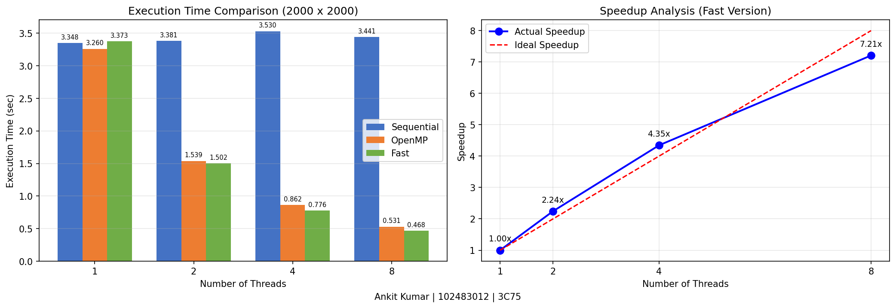

# Parallel Correlation Matrix Computation

**Name:** Ankit Kumar
**Roll No:** 102483012
**Group:** 3C75

---

## Problem Statement

Given a matrix of size **ny × nx** containing **m input vectors (rows)**,
compute the **correlation coefficient** between every pair of input vectors.

For all `0 ≤ j ≤ i < ny`, compute:

    correlation(row_i, row_j)

Store the result in the lower triangular matrix location:

    result[i + j * ny]

All arithmetic operations are performed using **double precision**.

---

## Implementations

Three versions are implemented in `corr_compute.cpp`, driven by `driver.cpp`:

| Version    | Description                                       |
|------------|---------------------------------------------------|
| Sequential | Baseline single-threaded implementation            |
| OpenMP     | Multi-threaded parallel implementation             |
| Fast       | OpenMP + SIMD + -O3 compiler optimizations         |

### File Structure

| File             | Purpose                                      |
|------------------|----------------------------------------------|
| driver.cpp       | Entry point, benchmarks all three versions   |
| corr_compute.cpp | Contains sequential, OpenMP, and fast kernels|
| Makefile         | Build automation with OpenMP flags           |

---

## Compilation

```bash
make
```

---

## Execution

```bash
./correlate <ny> <nx>
```

Example:

```bash
./correlate 2000 2000
```

---

# Performance Evaluation

**Matrix Size Tested:** 2000 × 2000

---

## Execution Time Comparison

### 1 Thread

| Version    | Time (sec) |
|------------|------------|
| Sequential | 3.34782    |
| OpenMP     | 3.25981    |
| Fast       | 3.37262    |

### 2 Threads

| Version    | Time (sec) |
|------------|------------|
| Sequential | 3.38115    |
| OpenMP     | 1.53872    |
| Fast       | 1.50234    |

### 4 Threads

| Version    | Time (sec) |
|------------|------------|
| Sequential | 3.53021    |
| OpenMP     | 0.861504   |
| Fast       | 0.776145   |

### 8 Threads

| Version    | Time (sec) |
|------------|------------|
| Sequential | 3.44072    |
| OpenMP     | 0.531134   |
| Fast       | 0.467907   |

---

# Speedup Analysis (Fast Version)

Speedup formula:

    Speedup = T1 / Tn

| Threads | Fast Time (sec) | Speedup  |
|---------|-----------------|----------|
| 1       | 3.37262         | 1.00×    |
| 2       | 1.50234         | 2.24×    |
| 4       | 0.776145        | 4.34×    |
| 8       | 0.467907        | 7.21×    |

Parallel Efficiency (8 threads):

    Efficiency = 7.21 / 8 ≈ 90.1%

---

# Performance Graph



---

# Optimization Techniques Used

- Precomputation of row means and normalization
- Lower triangular computation only
- OpenMP parallelization with parallel for
- Loop collapse for nested loops
- SIMD reduction pragma for vectorization
- Compiler optimization flag -O3
- Dynamic scheduling for load balancing
- Improved memory access locality

---

# Observations

- Time complexity grows approximately as O(ny² × nx).
- Parallel implementation significantly reduces execution time compared to sequential.
- Speedup scales nearly linearly up to 8 threads with 90.1% parallel efficiency.
- Sequential time remains roughly constant across thread configurations since it does not use parallelism.
- Memory bandwidth starts to limit scaling at higher thread counts.
- SIMD pragmas improve inner loop arithmetic throughput in the Fast version.

---

## Clean Build

```bash
make clean
```
